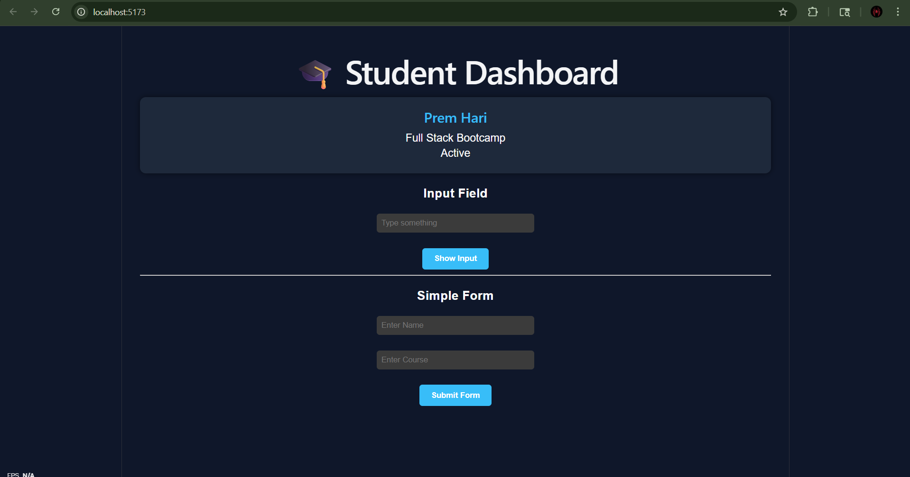
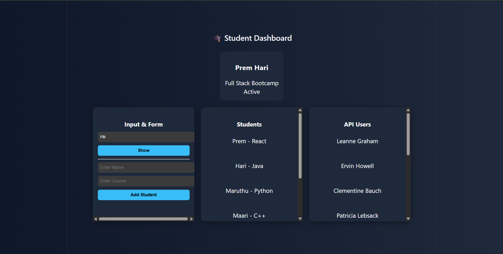
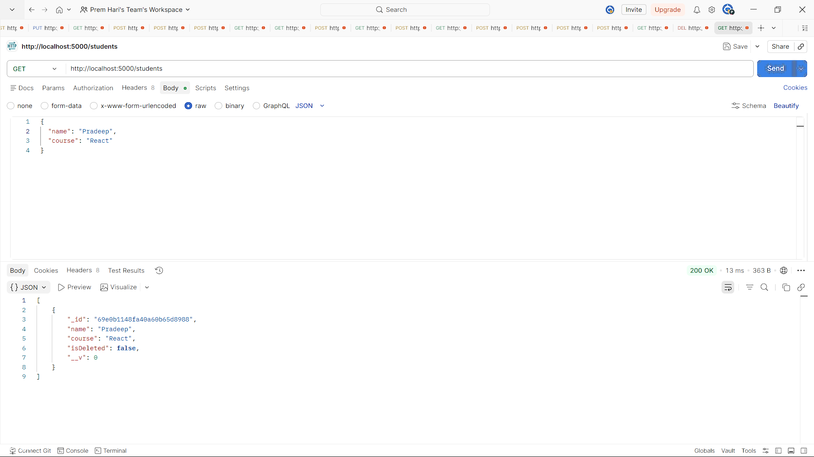
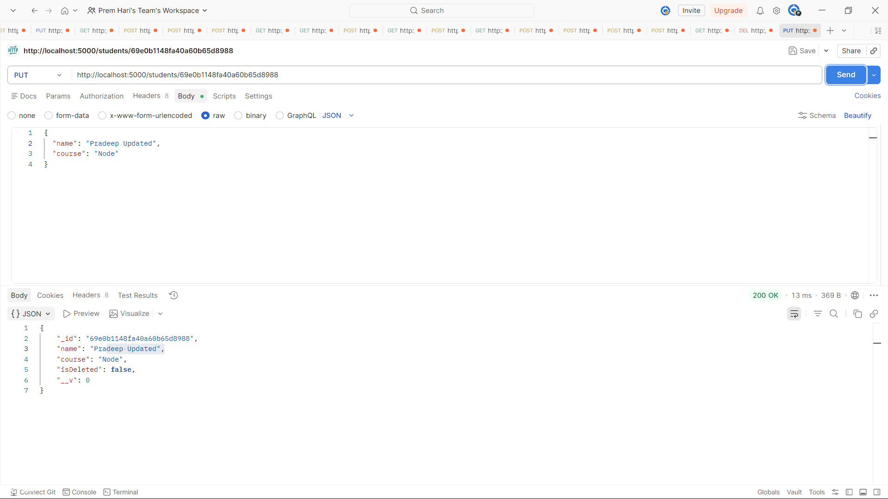
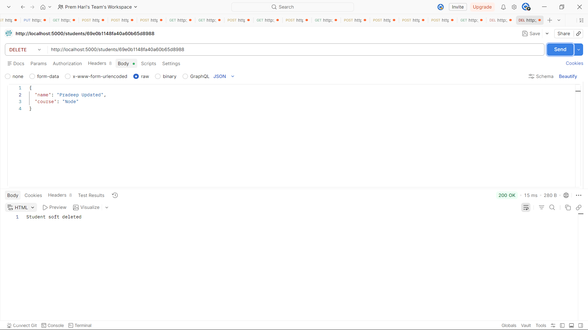
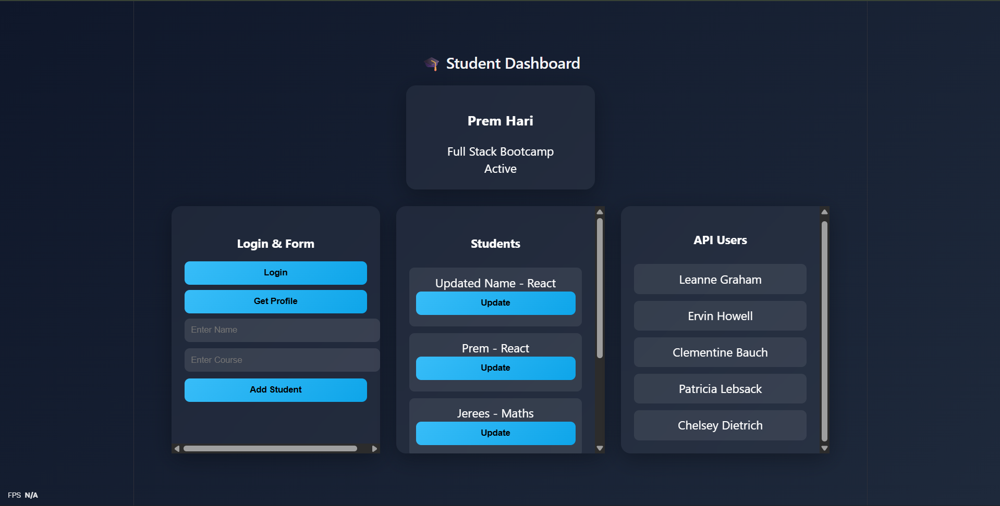
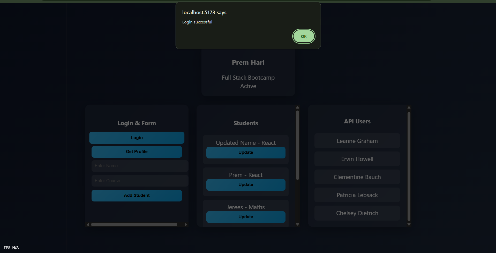
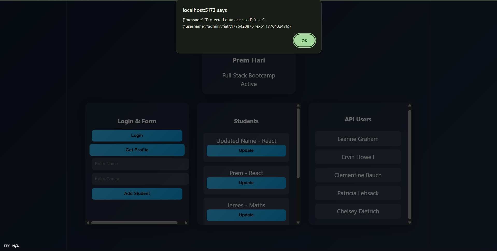

# Full Stack Bootcamp - Day 1, Day 2, Day 3 & Day 4

## Project Overview
This project was developed as part of the Full Stack Development with AI Bootcamp. It covers frontend and backend development by building a complete full-stack application using React, Node.js, Express, MongoDB, and JWT authentication.

---

## Day 1 - React Fundamentals

On Day 1, I learned the basics of React and built a simple UI.

### Concepts Covered
- Created a reusable component (StudentCard)
- Used props to pass data between components
- Managed input using useState
- Implemented event handling
- Built a simple form with input fields

### Output

---

## Day 2 - Dynamic React Application

On Day 2, I enhanced the application to make it more dynamic and interactive.

### Concepts Covered
- Rendered a list of students using map()
- Added unique keys for each item
- Implemented form submission to dynamically add students
- Used useEffect to fetch data from an external API
- Displayed API data in the UI

### Output

---

## Day 3 - Backend Development

On Day 3, I built the backend and connected it with a database.

### Concepts Covered
- Created a backend server using Node.js and Express
- Connected the application to MongoDB (local database)
- Created a student model using Mongoose
- Implemented CRUD operations:
  - Create (POST)
  - Read (GET)
  - Update (PUT)
  - Soft Delete (DELETE using isDeleted flag)
- Tested all APIs using Postman

---

## API Testing Screenshots

### Create API

### Read API

### Update API

### Delete API

---

## Day 4 - Full Stack Integration & Authentication

On Day 4, I integrated the frontend with backend APIs and implemented authentication using JWT.

### Concepts Covered
- Connected frontend with backend APIs
- Implemented Update API from UI to database
- Created Login API using JWT authentication
- Generated token on successful login
- Stored token in localStorage
- Accessed protected route using Bearer Token
- Verified complete flow (Frontend → Backend → Database → UI)

---

## Day 4 Output

### Dashboard

### Login Functionality

### JWT Authentication (Protected Route)

---

## Technologies Used

### Frontend
- React (Vite)
- JavaScript (ES6)
- CSS

### Backend
- Node.js
- Express.js
- MongoDB
- Mongoose
- JSON Web Token (JWT)

---

## How to Run

### Frontend

npm run dev  

### Backend

cd backend  
node server.js  

---

## Author

Prem Hari S

---

## Conclusion

This project demonstrates the complete full-stack development workflow including frontend UI, backend API creation, database integration, and authentication using JWT. It reflects real-world application architecture and secure data handling.